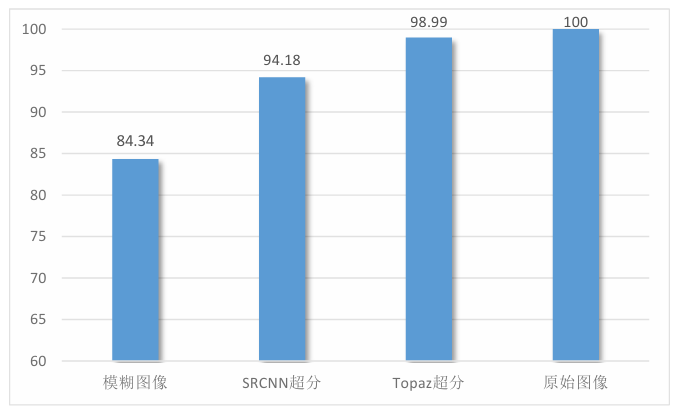

# OrpheusNet

OrpheusNet is an adaptive segment-based triadic Optical Music Recognition (OMR) system designed for numbered musical notation (jianpu). It combines morphological analysis methods and image classification neural networks to accomplish the conversion from input number musical notation images to corresponding MIDI files.

OrpheusNet primarily consists of four parts: super-resolution reconstruction, symbol extraction, note recognition, and digital music score encoding. 

## Super-resolution Reconstruction
To enhance the system's robustness and its ability to handle blurry input images, we use super-resolution models for image preprocessing. In this system, we compared the effects of compressed input(a), use of SRCNN(b), Topaz Gigapixel AI(c), and original input(b):

## Symbol Extraction
Extraction is accomplished utilizing projection. First we separate the melody lines and lyric lines based on bar line features. After that, we implement horizontal projection (with adjustments) to devide the melody line into three parts :

We identify each notes from the middle part using vertical projection and successfully extract them and their counterpart in the down part.

## Note Recognition
Recognition is also divided into four sections: upper, middle, and lower parts, as well as the metadata section in the upper left corner of the numbered musical notation. The upper and lower symbols are recognized using morphological features, while the middle and metadata symbols are recognized using neural networks (CNN, ResNet18, and VGG16). 

UpNet

MiddleNet

DownNet

MetaNet

## Digital Music Score Encoding
Finally, we combine the results from the previous network through contour localization and assembly. Then we translate the meanings of the notes by context-based musical grammar analysis, before we use the Python music21 library to encode the digital score and output the MIDI files.

To make OrpheusNet more user-friendly, the entire system is encapsulated into a web application using Flask. Users can upload image files and receive MIDI files for download.

## Experiment Results
The 
experimental results show that: 
1. In datasets with normal clarity, OrpheusNet can achieve 
an average score accuracy (SA) of up to 99% using ResNet or VGG, comparing with the baseline model H-SPP-CNN, which is 95.6% 

2. After introducing the super-resolution 
preprocessing module, OrpheusNet can achieve a maximum score accuracy (SA) of 
98% in blurred datasets using CNN. 

## Other Application

### Numbered Musical Notation to Staff Notation

method: numbered nusical notation —— MIDI (using OrpheusNet) —— staff notation (using MuseScore Studio4)

